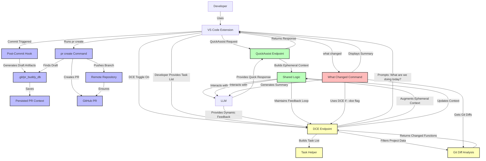

# Updated Conversational Context Documentation

## 1. Flow of Logic for the Conversational Context (Revised)

### a. Overview of Components

1. **VS Code Extension:**
   - **Interface Role:** Acts as the user interface, facilitating interactions between the developer and the `prbuddy-go` backend.
   - **Activation Mechanism:** Includes a slider or toggle to activate/deactivate the DCE.
   - **Data Retrieval:** Fetches data from VS Code APIs (e.g., linter results, project structure) based on commands from the backend.

2. **`prbuddy-go` Backend:**
   - **Core Functionality:** Manages PR drafts, handles Git hooks, interacts with the LLM, and incorporates the DCE.
   - **Two-Step PR Workflow:** Separates draft generation from PR creation (key change from PR #72)
   - **Conversation Management:** Utilizes `contextpkg` to manage and persist conversations related to PR drafts.
   - **Dynamic Context Engine (DCE):** Generates and maintains dynamic, task-based conversation contexts.

3. **Dynamic Context Engine (DCE):**
   - **Activation:** Triggered via the VS Code extension's slider or through commands like `what --dce`.
   - **Proactive Interaction:** Initiates conversations (e.g., "What are we doing today?") to build a task list.
   - **Dynamic Context Building:** Adjusts conversational context based on the generated task list and ongoing interactions.
   - **Integration with VS Code APIs:** Determines what data to fetch based on dynamic filtering logic.

### b. Step-by-Step Logical Flow (Updated)

1. **Initialization:**
   - Developer installs and initializes `prbuddy-go` in their Git repository using the `init` command.
   - This sets up necessary Git hooks and directories for persisting PR-related conversations.

2. **Commit Workflow (Two-Step Process):**
   - **Step 1: Draft Generation (Automatic)**
     - Developer makes a commit
     - The post-commit hook triggers, generating a draft PR artifact in `.git/pr_buddy_db`
     - The hook checks if a draft already exists for the current commit (idempotency)
     - If extension is active, the draft is sent to VS Code for display
     - **No PR is created at this stage**
   
   - **Step 2: PR Creation (Explicit Action)**
     - When ready, developer runs `prbuddy-go pr create` (or `make pr`)
     - The command ensures the branch is pushed to remote (with tracking if needed)
     - It locates the saved draft artifacts
     - Creates the PR using GitHub's API with the saved draft content
     - Returns the PR URL upon success

3. **DCE Interaction Flow:**
   - Developer activates DCE via VS Code extension or `what --dce` command
   - DCE prompts "What are we working on today?" to build a task list
   - Based on tasks, DCE filters project data using Git diffs and file analysis
   - This filtered data augments the conversation context for more relevant responses
   - DCE maintains context during the session but does not persist it (ephemeral)

4. **Context Management:**
   - **PR-Related Conversations:** Persisted in `.git/pr_buddy_db` for iteration
   - **DCE/QuickAssist Conversations:** Ephemeral, reset when session ends
   - **Context Augmentation:** DCE dynamically adds relevant project data to conversation context

5. **Command Integration:**
   - `what changed` command uses DCE when `--dce` flag is provided
   - `pr create` command uses saved artifacts without DCE involvement
   - Interactive session routes commands through Cobra's proper execution flow

---

## 2. Updated Mermaid Diagram: Conversational Context Handling



### Explanation of the Updated Diagram

1. **Two-Step PR Workflow (Blue Path)**
   - **Commit Triggered:** Post-commit hook generates draft artifacts
   - **Draft Artifacts:** Saved in `.git/pr_buddy_db` (idempotent)
   - **PR Creation:** Requires explicit `pr create` command
   - **Branch Pushing:** Handled before PR creation to ensure GitHub can autofill details

2. **DCE Interaction (Yellow Path)**
   - **Task-Based Context:** DCE builds context around developer-provided tasks
   - **Git Diff Analysis:** Identifies changed functions for relevant context
   - **Dynamic Augmentation:** Continuously updates conversation context

3. **what changed Command (Red Path)**
   - **DCE Integration:** Optional `--dce` flag provides context-aware summaries
   - **Standard Workflow:** Without DCE, provides basic diff summary

4. **Key Architectural Change**
   - **Clear Separation:** Draft generation (automatic) vs. PR creation (explicit)
   - **Idempotent Artifacts:** Ensures draft generation is safe to run repeatedly
   - **Branch Push Guarantee:** PR creation only happens after branch is pushed

---

## 3. Updated Evaluation of Conceptual Model

### a. Key Improvements from PR #72

1. **Proper Separation of Concerns**
   - **Draft Generation:** Handled by post-commit hook (fast, non-blocking)
   - **PR Creation:** Handled by dedicated command (can be slower, interactive)
   - **Eliminated "Chicken and Egg" Problem:** No longer modifying the tool while it's running itself

2. **Idempotent Artifact Generation**
   - Drafts are only generated when needed (commit-specific artifacts)
   - Multiple runs of the hook don't create duplicate work
   - Safe for CI/CD environments and manual invocations

3. **Branch Push Guarantee**
   - PR creation command ensures branch is pushed first
   - Eliminates "Head sha can't be blank" errors from GitHub API
   - Proper branch tracking setup for new branches

4. **Streamlined UI**
   - Interactive session uses proper Cobra command execution
   - Eliminated segmentation faults from nil pointer dereferences
   - Clear command structure with shortcuts and aliases

### b. DCE Integration Status

1. **Current DCE Usage**
   - Primarily used with `what --dce` command for context-aware summaries
   - Not directly integrated with PR creation (keeps PR workflow simple)
   - Used in interactive sessions for dynamic context building

2. **DCE Data Flow**
   - Task List Generation → Project Data Filtering → Context Augmentation
   - Uses Git diffs to identify changed functions
   - Builds file hierarchy for relevant files
   - Provides simplified linter results (placeholder for future integration)

3. **Context Management**
   - PR-related conversations: persisted in `.git/pr_buddy_db`
   - DCE interactions: ephemeral, reset when session ends
   - Context augmentation: DCE adds system-level messages with task context

---

## 4. Updated Considerations and Implementation Details

### a. Two-Step PR Workflow Benefits

1. **Developer Control**
   - Developers choose when to create PRs (not automatic)
   - Can review and modify drafts before PR creation
   - Works well with both simple and complex workflows

2. **Reliability Improvements**
   - No more PR creation failures blocking commits
   - Branch pushing happens before PR creation
   - Better error handling with clear feedback

3. **Artifact-Based Idempotency**
   - Drafts are generated based on commit-specific artifacts
   - No heuristic-based skipping (like "is branch synced with upstream")
   - Clear signal for whether work needs to be done

### b. DCE Integration Points

1. **Command Integration**
   - `what --dce`: Generates context-aware summaries of changes
   - Interactive session: DCE can be activated during QuickAssist
   - Not used in PR creation (keeps workflow simple and focused)

2. **Data Flow**
   ```mermaid
   graph LR
       A[User Task Input] --> B[Task List Generation]
       B --> C[Git Diff Analysis]
       C --> D[Changed Functions]
       D --> E[File Hierarchy]
       E --> F[Linter Results]
       F --> G[Context Augmentation]
       G --> H[LLM Response]
   ```

3. **Context Augmentation Strategy**
   - DCE adds system messages with task context
   - Task list is prioritized in conversation context
   - Filtered project data enhances relevance of responses
   - Clear separation from persistent PR conversations

### c. Implementation Details

1. **Draft Artifact Structure**
   ```
   .git/pr_buddy_db/
   └── sanitized-branch-name/
       └── commit-abc123/
           ├── draft.md
           ├── conversation.json
           └── draft_context.json
   ```

2. **PR Creation Flow**
   ```go
   func runPRCreate() {
       // 1. Get branch/commit info
       // 2. Push branch to remote (with tracking if needed)
       // 3. Find draft artifacts
       // 4. Create PR with gh CLI
       // 5. Return PR URL
   }
   ```

3. **DCE Task Processing**
   ```go
   func BuildTaskList(input string) ([]Task, map[string]string, []string, error) {
       // Uses NLP to parse input into tasks
       // Returns tasks, code snapshots, and logs
   }
   
   func FilterProjectData(tasks []Task) ([]FilteredData, []string, error) {
       // Uses git diff to find changed functions
       // Builds file hierarchy for relevant files
       // Returns filtered data and logs
   }
   ```

---

## 5. Recommendations for Future Development

### a. Enhanced DCE Integration

1. **PR Context Awareness**
   - Option to use DCE context when generating PR drafts
   - Task-based PR descriptions that highlight relevant changes

2. **Linter Integration**
   - Connect with actual linters (golangci-lint, etc.)
   - Provide real code quality insights in DCE context

3. **Tree-sitter Enhancements**
   - More precise function change detection
   - Better code structure analysis for context building

### b. Workflow Improvements

1. **Draft Review Workflow**
   - Command to view and edit drafts before PR creation
   - Integration with VS Code for draft editing

2. **Automated PR Updates**
   - Option to update existing PRs with new drafts
   - Track PR status and provide update suggestions

3. **CI/CD Integration**
   - Support for generating PRs in CI environments
   - Integration with GitHub Actions for automated PR creation

### c. User Experience

1. **Interactive PR Creation**
   - Prompt for PR title, reviewers, labels before creation
   - Preview draft before creating PR

2. **Context Switching**
   - Clear separation between PR context and DCE context
   - Visual indicators of active context in VS Code extension

3. **Error Recovery**
   - Better handling of failed PR creations
   - Options to retry with different parameters

---

## 6. Conclusion

The separation of draft generation from PR creation (PR #72) represents a significant architectural improvement that aligns with Git hook best practices while providing developers with greater control over their workflow.

**Key Takeaways:**

- **Two-Step PR Workflow:** Automatic draft generation + explicit PR creation
- **Idempotent Artifacts:** Drafts are generated only when needed, based on commit-specific artifacts
- **Branch Push Guarantee:** PR creation only happens after ensuring branch is pushed
- **Clear Separation:** Draft generation (fast, non-blocking) vs. PR creation (interactive)
- **DCE Integration:** Context-aware assistance for commands like `what --dce`

This architecture provides a robust foundation for future enhancements while maintaining reliability and developer control. The clear separation of concerns makes the system more maintainable, while the idempotent artifact generation ensures safe operation in all environments.

The DCE continues to provide valuable context-aware assistance, particularly for understanding changes through the `what --dce` command, while the two-step PR workflow ensures that PR creation happens reliably when the developer is ready.