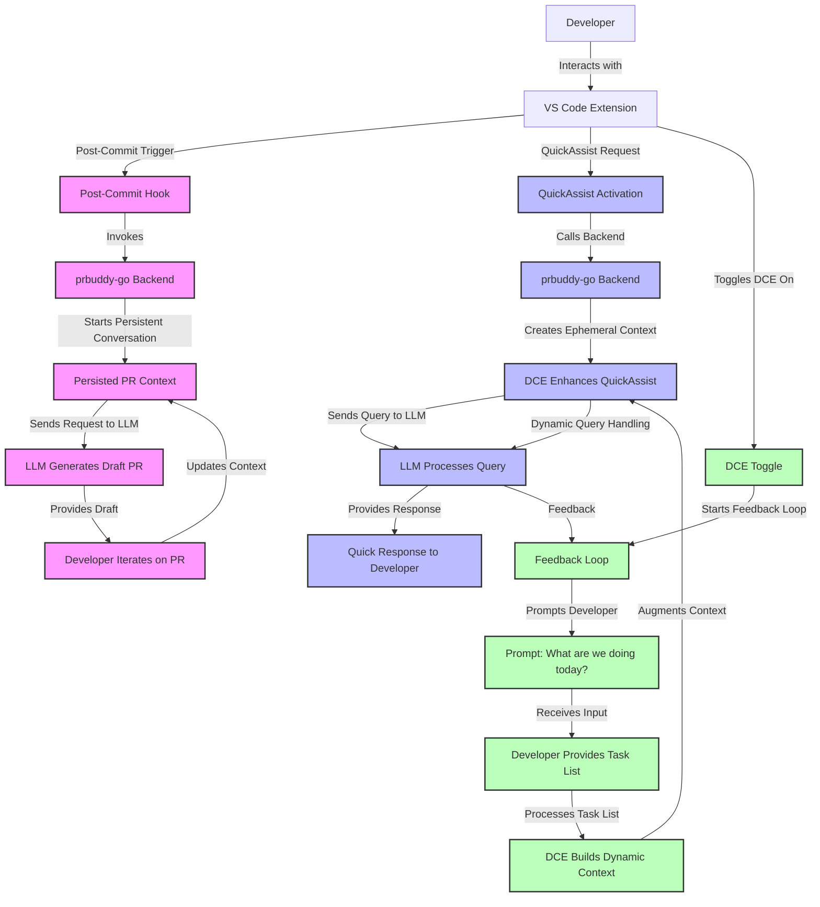
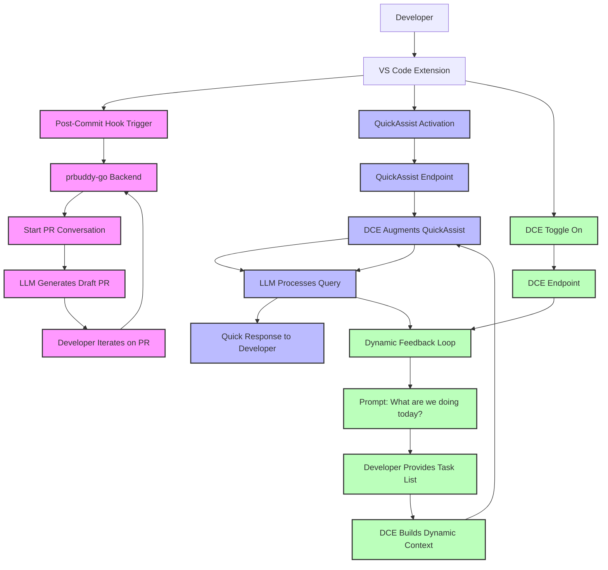

Refined Mermaid Diagram: Developer Interaction with VS Code Extension

---

## Function Extraction

The DCE uses Tree-sitter for accurate Go function extraction. 

**Limitations**:
- Go files only (`.go` extension)
- Requires valid Go syntax (parse errors = empty function list)
- First run parses entire repo (subsequent runs benefit from caching)

**Path Normalization**:
Tree-sitter may return absolute paths while git returns relative paths.
The `normalizeFilePath()` function handles this automatically.